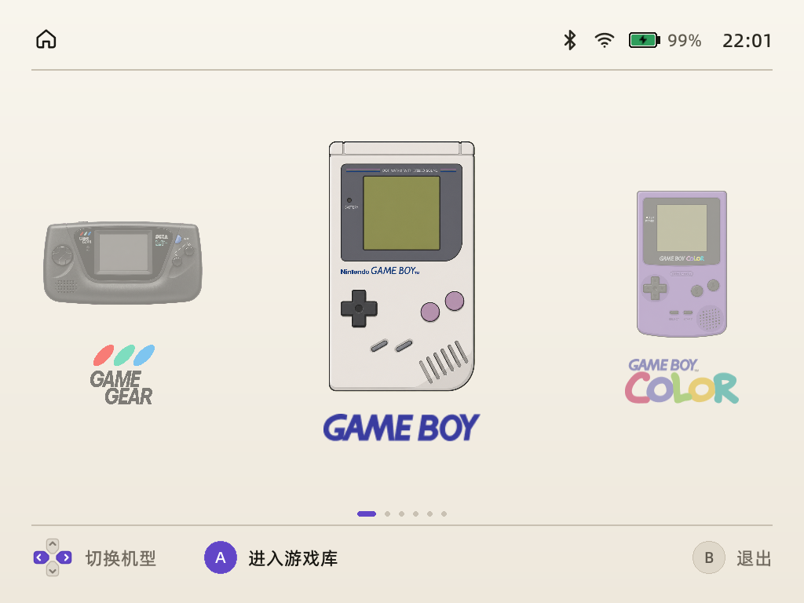
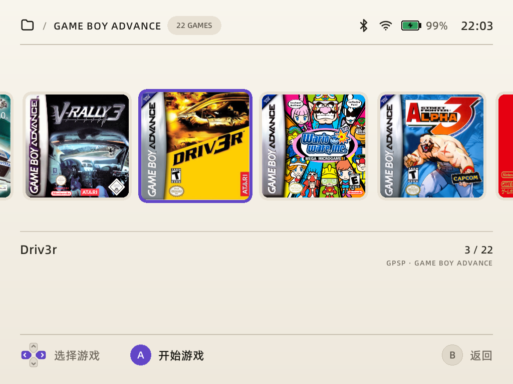
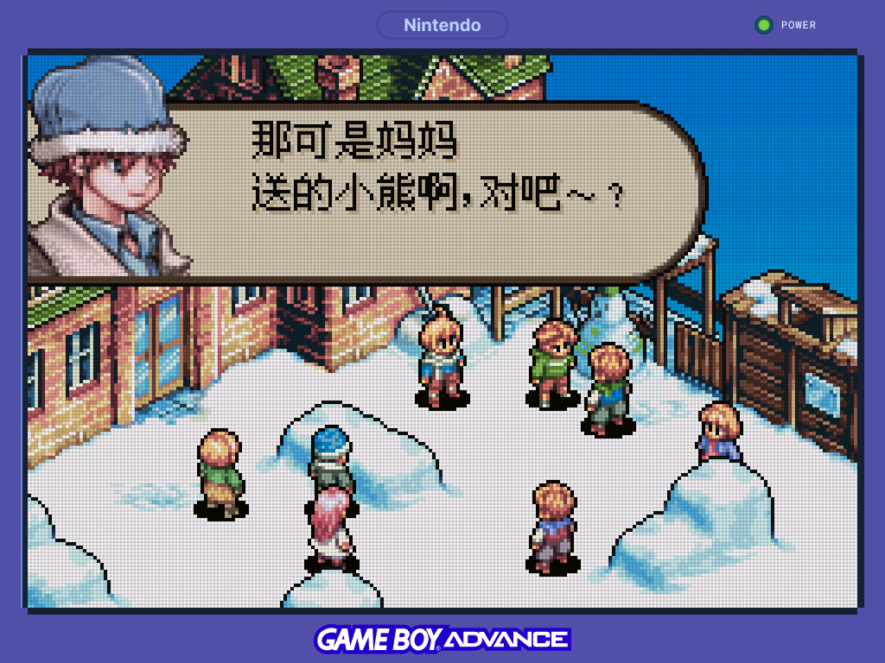
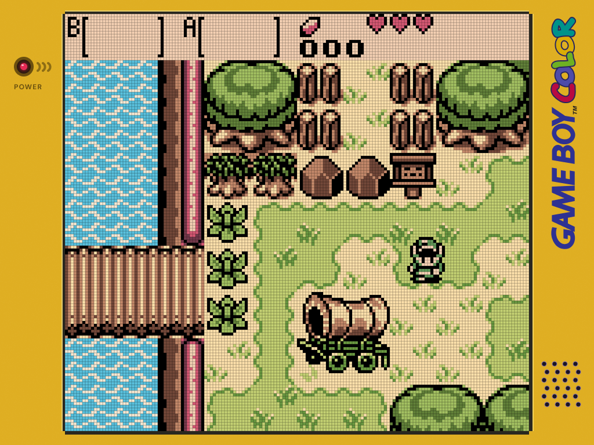
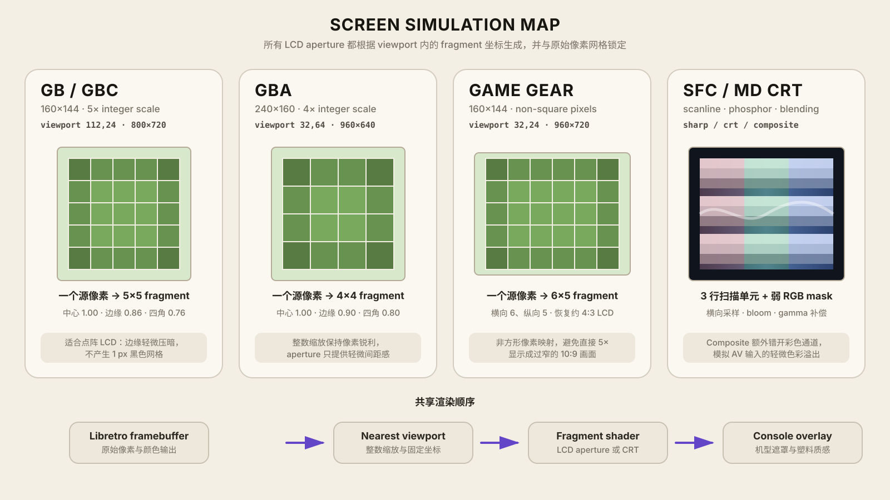

# rmlui-brick

面向 TrimUI Brick 的掌机桌面与模拟器前端，使用 **RmlUi + SDL2 + MinArch** 构建。界面按设备原生 `1024×768` 分辨率设计，负责机型选择、ROM 浏览、模拟器启动、状态恢复以及不同平台的屏幕视觉效果。

项目不替换原厂 `MainUI`，也不修改开机流程。桌面与模拟器通过独立 launcher 依次占用显示、音频和手柄，游戏退出后会回到之前选择的机型与 ROM。

## 当前界面

<table>
  <tr>
    <td width="50%" align="center">
      
    </td>
    <td width="50%" align="center">
      
    </td>
  </tr>
  <tr>
    <td align="center"><sub>六机型首页与无限循环轮播</sub></td>
    <td align="center"><sub>从 SD 卡扫描生成的游戏封面轨道</sub></td>
  </tr>
</table>

首页支持左右无限循环。当前机型居中放大，相邻机型从屏幕两侧正常平移；首尾切换不会让后备卡片跨屏飞动。游戏库从 SD 卡实时扫描 ROM，以封面轨道展示游戏。方向键选择，`A` 进入或启动，`B` 返回；顶部显示当前平台、游戏数量、电量、无线状态和时间。

### 游戏内效果

<table>
  <tr>
    <td width="50%" align="center">
      
    </td>
    <td width="50%" align="center">
      
    </td>
  </tr>
  <tr>
    <td align="center"><sub>Game Boy Advance · 4×4 LCD aperture</sub></td>
    <td align="center"><sub>Game Boy Color · 5×5 LCD aperture</sub></td>
  </tr>
</table>

GBA 游戏以原生 `240×160` 网格进行 4 倍整数缩放，显示区域为 `960×640`；GBC 游戏将原生 `160×144` 网格以 5 倍整数缩放到 `800×720`。两者都通过 fragment shader 生成绑定源像素的 LCD aperture，再叠加颗粒质感和各自的机型遮罩。截图来自当前真机运行帧缓冲，未使用桌面预览或后期效果模拟。

## 屏幕模拟



示意图将每个源像素对应的输出 fragment 单元放大展示，并列出各平台的原始分辨率、固定 viewport 和渲染顺序。LCD 平台根据 fragment 在整数缩放单元中的位置生成 aperture；CRT 平台则使用扫描线、弱 phosphor mask、横向融合、bloom 和 gamma 补偿。

GBA 的 `240×160` 画面以 4 倍整数缩放到 `(32,64,960,640)`。fragment shader 根据 fragment 相对游戏 viewport 的位置生成 4×4 aperture，效果绑定原始像素网格，不使用简单平铺的黑色网格图。

GB/GBC 的 `160×144` 画面以 5 倍整数缩放到 `(112,24,800,720)`，由独立的 GB/GBC fragment shader 生成 5×5 aperture。原有 `gb-gbc-lcd-5x.png` 仅作为 GLES2 初始化失败时的 SDL renderer 回退资源。

Game Gear 的 core 输出 `160×144`。原机 LCD 使用非方形像素，因此映射为 `(32,24,960,720)`，每个源像素对应 6×5 输出单元；shader 只轻微压暗单元边缘，随后再合成 Game Gear 遮罩。

SFC 与 MD 使用独立 CRT 管线，提供：

- `sharp`：清晰像素和较弱扫描线；
- `crt`：轻微横向融合、bloom 和暗角；
- `composite`：进一步模拟 AV 色彩溢出；
- `off`：关闭屏幕 shader。

更完整的尺寸、overscan 和预设说明见 [模拟器接入方案](docs/EMULATOR_INTEGRATION.md)。

## 已支持平台

| 平台 | 系统目录 | ROM 格式 | Libretro core | 屏幕处理 |
| --- | --- | --- | --- | --- |
| Game Boy | `GB` | `.gb` `.zip` | Gambatte | 5× 整数缩放、5×5 LCD aperture |
| Game Boy Color | `GBC` | `.gbc` `.zip` | Gambatte | 5× 整数缩放、5×5 LCD aperture |
| Game Boy Advance | `GBA` | `.gba` `.zip` | gpSP | 4× 整数缩放、4×4 LCD aperture |
| Super Nintendo / SFC | `SFC` | `.sfc` `.smc` `.zip` | Snes9x 2005 Plus | Sharp、CRT、Composite 预设 |
| Sega Genesis / Mega Drive | `MD` | `.md` `.gen` `.bin` `.smd` `.zip` | PicoDrive | Sharp、CRT、Composite 预设 |
| Sega Game Gear | `GG` | `.gg` `.zip` | PicoDrive | 6×5 LCD aperture、4:3 LCD 显示 |

所有平台都使用相同的 ROM、封面、存档和启动约定，不需要把游戏列表写死在代码中。

## 主要能力

- 原生 `1024×768` 全屏 RmlUi 界面，使用设备 OpenGL ES 2 renderer。
- 六机型首页轮播、居中选中态和连续首尾循环。
- 自动扫描 ROM 目录，并按文件名匹配封面。
- 启动 MinArch 后释放桌面的显示、音频和手柄资源。
- 模拟器正常退出后恢复原机型、目录和选中游戏。
- 使用设备字体显示中文，不随项目重新分发字体文件。
- 首页显示 AXP2202 电池电量和当前时间。
- 静止时采用 dirty rendering，不持续提交重复帧。
- MinArch 源码、core、pak 和渲染资源已经 vendoring，可独立构建，不需要修改相邻 MinUI 仓库。

电脑端另有 `rom-manager` 配套应用，可管理本地与真机游戏、元数据、封面和存档，并一键安装或卸载 ROM。

## ROM 与资源约定

```text
/mnt/SDCARD/
├── Roms/
│   ├── GB/
│   ├── GBC/
│   ├── GBA/
│   ├── SFC/
│   ├── MD/
│   └── GG/
├── Bios/{GB,GBC,GBA,SFC,MD,GG}/
├── Saves/{GB,GBC,GBA,SFC,MD,GG}/
└── .system/tg5040/
    ├── bin/minarch.elf
    ├── cores/
    ├── paks/Emus/
    └── res/
```

每个系统目录内使用以下伴随文件：

```text
Roms/GBA/
├── Example.gba
├── .media/Example.png
└── .meta/Example.json
```

- ROM 文件名就是默认显示标题。
- 封面路径为 `.media/<ROM 文件名去掉扩展名>.png`。
- 元数据路径为 `.meta/<ROM 文件名去掉扩展名>.json`。
- 没有封面或元数据不会阻止 ROM 被识别和启动。
- ROM Manager 会按相同约定安装文件，因此桌面刷新后即可显示。

## 运行架构

```text
原厂 runtrimui.sh
  └── rmlui-brick launcher
      ├── RmlUi 桌面
      │   └── 写入 {system, ROM path} 启动请求后正常退出
      ├── MinArch + 对应 Libretro core
      │   └── 从 MinArch 菜单正常退出
      └── 重新启动 RmlUi，恢复选择状态
```

桌面和 MinArch 不会同时持有 SDL 窗口。launcher 还会校验 ROM 必须位于 `/mnt/SDCARD/Roms`，且系统与扩展名相匹配。

> 游戏运行时不要远程结束 `minarch.elf`。MinArch 同时管理显示、音频、输入和电源状态，应当从游戏内菜单正常退出；项目 launcher 在 emulator 模式下也会拒绝远程 `stop`。

## 构建

开发机需要 CMake、Zig 和 SDL2_image：

```sh
brew install cmake zig sdl2_image
```

### macOS 预览

```sh
./scripts/build-macos.sh
FONT=/tmp/trimui-regular.ttf ./scripts/run-macos.sh
```

### TrimUI Brick

```sh
./scripts/build-brick.sh
./scripts/package-brick.sh
```

`build-brick.sh` 会同时构建 ARM64 前端和仓库内的 MinArch。固定版本的 RmlUi 与 TG5040 SDK 会下载到被忽略的 `.deps/`，最终自包含目录位于：

```text
build/package/rmlui-prototype/
├── trimui-rmlui-prototype
├── launch.sh
├── assets/
└── runtime/tg5040/
```

## 真机部署与调试

安装模拟器 runtime：

```sh
./scripts/install-emulator-runtime.sh
```

启动桌面：

```sh
./scripts/run-brick.sh start
```

常用命令：

```sh
./scripts/run-brick.sh status
./scripts/run-brick.sh logs
./scripts/run-brick.sh stop
```

默认连接 `root@192.168.31.117`，默认远端目录为 `/mnt/UDISK/trimui-dev/rmlui-prototype/current`。可以覆盖：

```sh
TRIMUI_DEVICE=root@192.168.1.20 \
TRIMUI_REMOTE_DIR=/mnt/UDISK/trimui-dev/rmlui-prototype/current \
./scripts/run-brick.sh start
```

launcher 通过原厂 `/tmp/cmd_to_run.sh` 完成显示交接。桌面退出后，原厂 `MainUI` 会由 `runtrimui.sh` 自动恢复。

程序本身支持以下调试参数：

```text
--seconds N         N 秒后自动退出
--screenshot FILE   稳定渲染后保存 BMP 截图
--rom-root DIR      指定 ROM 根目录
--request FILE      UI 与 launcher 的启动请求文件
--state FILE        保存和恢复当前机型、ROM 选择
--renderer NAME     指定 SDL renderer
--dp-ratio N        UI 密度倍率，范围 0.5～4.0
--fullscreen        全屏运行
```

## 性能

桌面静止时不重复提交画面，但仍以约 16 ms 周期轮询手柄，保证输入延迟不超过一帧。发生输入后，仅在动画期间恢复连续渲染。

| 实机静止状态 | 优化前 | 当前实现 |
| --- | ---: | ---: |
| 整机 CPU 占用 | 约 8.5% | 约 0.39% |
| 单核等效占用 | 约 34% | 约 1.56% |
| 桌面提交帧率 | 约 60.2 FPS | 0 FPS |
| 实测 CPU 频率 | 约 1008 MHz | 最低约 408 MHz |

这些数据来自当前开发阶段的实机采样，不代表固定亮度和统一无线状态下的完整续航测试。

## 项目结构

```text
.
├── assets/                    # RML、RCSS、机型图和 UI 资源
├── cmake/                     # Zig ARM64 交叉编译配置
├── docs/                      # 接入与 RmlUi 文档
├── scripts/                   # 构建、打包、安装和真机运行脚本
├── src/                       # RmlUi 桌面与 ROM catalog
└── vendor/
    ├── minarch/               # 项目维护的 MinArch 源码
    └── tg5040/                # core、pak、遮罩和目标机 runtime
```

关键实现选择：

- 固定 RmlUi 6.2 commit `2230d1a6e8e0848ed87a5761e2a5160b2a175ba4`；
- C++14 与 Zig ARM64 toolchain；
- 自定义 SDL renderer，直接使用 `SDL_RenderGeometry`；
- PNG 上传前转换为预乘 Alpha；
- 缓存 RmlUi 几何数据，避免每帧重复转换和分配；
- 设备端动态链接已有的 SDL2、SDL2_image、FreeType 和 glibc；
- GameController 可用时忽略重复的底层 Joystick hat 事件，防止一次按键移动两格。
- 屏幕 shader 按 GB/GBC、GBA、Game Gear 和 CRT 管线拆分在 `vendor/minarch/src/platform/tg5040/shaders/`，MinArch 只编译当前机型对应的 fragment shader。

## 文档

- [模拟器接入、shader 与安全退出](docs/EMULATOR_INTEGRATION.md)
- [RmlUi 6.2 RCSS 使用指南](docs/RCSS_GUIDE.md)
- [RML 元素与滚动列表](docs/RML_ELEMENTS.md)

## 当前限制

- 收藏、最近游玩和游玩时长尚未接入桌面。
- 音量、亮度、Wi-Fi、蓝牙和休眠恢复尚未形成完整的桌面设置页。
- GBA 暂未提供 mGBA fallback core。
- 自动降亮度、闲置关屏和严格续航测试仍待完成。
- 开发构建仍包含 RmlUi Debugger，Release 版本后续应移除。
- 原厂环境会打印一次无害的 `setterm: not found`，不影响运行。
