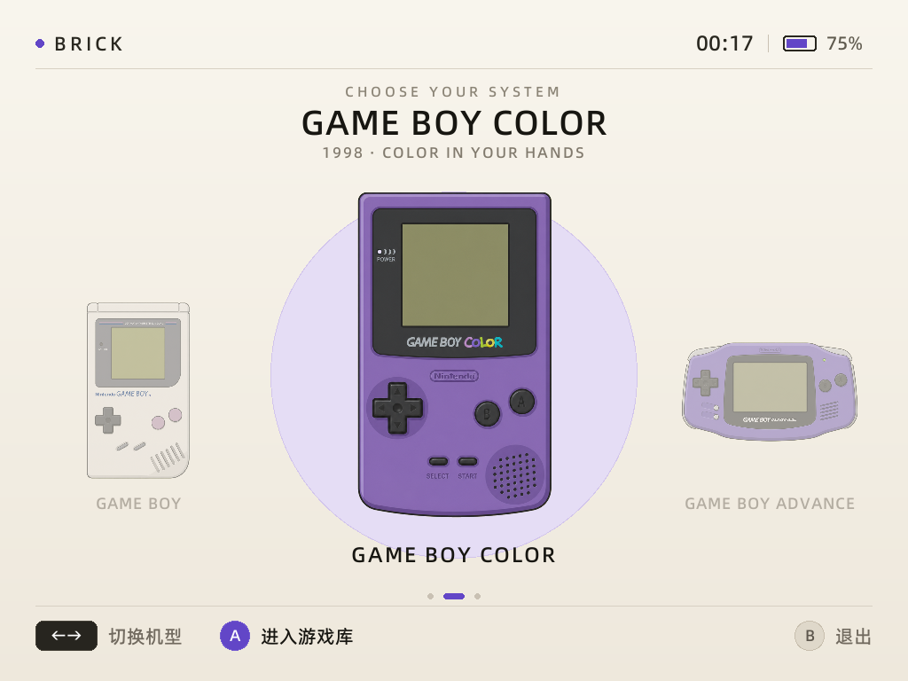

# rmlui-brick

基于 **RmlUi + SDL2** 为 TrimUI Brick 持续开发的掌机桌面项目。界面使用设备原生 1024×768 物理像素设计，目标是提供机型选择、游戏浏览、模拟器启动、系统状态和统一的游戏内视觉体验。



上图由 TrimUI Brick 实机运行后直接截取。当前首页顶部显示时间和电量，中间通过横向 roll 选择 Game Boy、Game Boy Color 和 Game Boy Advance；选中机型居中放大，方向键左右切换，A 键进入，B 键返回或退出。

RCSS 能写哪些属性、与浏览器 CSS 有什么差异，以及当前 renderer 的能力
边界，见 [RmlUi 6.2 RCSS 使用指南](docs/RCSS_GUIDE.md)。

RML 可用 UI 元素、表单控件、滚动列表和掌机焦点联动，见
[RML UI 元素与滚动列表](docs/RML_ELEMENTS.md)。

设备现有模拟器情况、GBA 方案以及桌面退出/模拟器运行/桌面恢复的接入流程，见
[模拟器接入方案](docs/EMULATOR_INTEGRATION.md)。

## 当前状态

实机验证已经通过：

- 1024×768 全屏输出正常；
- SDL renderer 为 `opengles2`；
- `SDL_RenderGeometry`、矩形裁剪和字体纹理工作正常；
- 预乘 Alpha 自定义混合模式可用，`renderer_ok=yes`；
- SDL2_image PNG 解码、透明图标和纹理上传工作正常；
- 使用设备 `/usr/trimui/res/regular.ttf` 的阿里巴巴普惠体，中文显示正常；
- 首页时间和 AXP2202 电池电量读取正常；
- GB/GBC/GBA 横向机型 roll、选中放大和循环切换正常；
- A 键进入机型页面，B 键返回；在首页按 B 可安全退出；
- SDL 将内置手柄识别为 `Xbox 360 Controller`；
- 切换动画期间稳定约 60 FPS，静止后停止全屏重绘，仅保留 16 ms 输入轮询；
- 时间只在分钟变化时刷新，电量每分钟检查一次，内容不变时不触发重绘；
- 程序退出后，原厂 `MainUI` 会由 `runtrimui.sh` 自动恢复；
- 没有修改原厂 `MainUI` 或开机流程。

## 性能与功耗

当前已完成桌面渲染路径的第一轮优化：

| 实机静止状态 | 优化前 | 当前版本 |
| --- | ---: | ---: |
| 整机 CPU 占用 | 约 8.5% | 约 0.39% |
| 单核等效占用 | 约 34% | 约 1.56% |
| 桌面提交帧率 | 约 60.2 FPS | 0 FPS |
| 实测 CPU 频率 | 约 1008 MHz | 最低可降至 408 MHz |

静止时仍以约 16 ms 的周期轮询手柄，确保按键延迟不超过一帧；发生输入后，
只在 220 ms 切换动画窗口内恢复连续渲染。这里没有使用
`SDL_WaitEventTimeout`，因为 Brick 自带 SDL 在启用手柄后会以约 1 kHz
轮询事件，反而产生额外的空闲 CPU 消耗。

自动降亮度、闲置关屏、休眠/唤醒、Wi-Fi/蓝牙电源策略、菜单 CPU 档位和
严格的固定亮度续航对比测试尚未实现。这些优化不阻塞 UI 与模拟器接入，
留到后续电源管理阶段集中处理。

实机部署位置：

```text
/mnt/UDISK/trimui-dev/rmlui-prototype/
├── current/
│   ├── trimui-rmlui-prototype
│   ├── launch.sh
│   └── assets/
├── latest.log
└── screenshot.bmp
```

## 代码结构

```text
.
├── assets/
│   ├── main.rml
│   ├── main.rcss
│   ├── icons/
│   │   ├── gb-dmg-simple.png
│   │   ├── gbc-atomic-purple-simple.png
│   │   └── gba-indigo-simple.png
│   └── launch-brick.sh
├── cmake/
│   └── zig-aarch64-linux.cmake
├── scripts/
│   ├── build-macos.sh
│   ├── build-brick.sh
│   ├── package-brick.sh
│   ├── run-brick.sh
│   ├── run-macos.sh
│   └── setup-toolchain.sh
├── docs/
│   ├── images/desktop-v1.png
│   ├── EMULATOR_INTEGRATION.md
│   ├── RCSS_GUIDE.md
│   └── RML_ELEMENTS.md
└── src/
    ├── main.cpp
    ├── prototype_render_interface.*
    └── prototype_system_interface.*
```

## 关键技术选择

- 固定 RmlUi 6.2 commit `2230d1a6e8e0848ed87a5761e2a5160b2a175ba4`；
- 使用 C++14 编译，以匹配 RmlUi 6.2 和旧目标环境；正式项目仍可使用 C++17；
- 自定义 RmlUi SDL renderer 直接调用 `SDL_RenderGeometry`；
- 使用 SDL2_image 加载 PNG，并在上传前转换为预乘 Alpha；
- RmlUi 几何数据在编译阶段转换并缓存，渲染阶段复用顶点缓冲，避免逐元素重复申请内存；
- 使用 dirty rendering：只在输入、动画、时钟或电量发生变化时调用 RmlUi 更新和全屏提交；
- 仅动态链接设备已有的 SDL2、SDL2_image、FreeType 和 glibc；C++ 标准库由 Zig 链接，不依赖目标机的 `GLIBCXX` 版本；
- 使用 TrimUI TG5040 SDK 的 SDL2、SDL2_image 和 FreeType 头文件及链接库；
- 默认不包含字体文件，实机复用原厂字体，避免复制或重新分发字体资源。

同一个方向键动作会同时产生 SDL GameController 和底层 Joystick hat 事件。程序在 GameController 成功打开时只处理高层事件，底层 hat/axis 仅作为兼容后备，防止一次按键移动两格。

## 构建

开发机需要 CMake、Zig 和 SDL2_image：

```sh
brew install cmake zig sdl2_image
git clone --depth 1 --branch 6.2 \
  https://github.com/mikke89/RmlUi.git /tmp/RmlUi-6.2
```

本机版本：

```sh
./scripts/build-macos.sh
FONT=/tmp/trimui-regular.ttf ./scripts/run-macos.sh
```

Brick 版本：

```sh
./scripts/build-brick.sh
./scripts/package-brick.sh
```

`setup-toolchain.sh` 会下载并校验官方 TG5040 SDK，解压到被忽略的 `.deps/`。生成的可部署目录位于 `build/package/rmlui-prototype/`。

## 实机运行

在开发机运行（会提示输入设备 SSH 密码）：

```sh
./scripts/run-brick.sh start
```

退出方式：

- 在掌机上按 `B`，程序正常退出，原厂 `MainUI` 自动恢复；
- 界面无响应时，在开发机执行 `./scripts/run-brick.sh stop`；
- `./scripts/run-brick.sh status` 查看状态；
- `./scripts/run-brick.sh logs` 查看最近 100 行日志。

脚本默认连接 `root@192.168.31.117`，默认程序目录为
`/mnt/UDISK/trimui-dev/rmlui-prototype/current`。可以分别用
`TRIMUI_DEVICE` 和 `TRIMUI_REMOTE_DIR` 环境变量覆盖。脚本不包含或保存密码。

也可以在设备端直接启动低层 launcher：

```sh
cd /mnt/UDISK/trimui-dev/rmlui-prototype/current
./launch.sh
```

调试参数：

```text
--seconds N         N 秒后自动退出
--screenshot FILE   稳定渲染后保存 BMP 截图
--renderer NAME     指定 SDL renderer；Brick 使用 opengles2
--dp-ratio N        UI 密度倍率；默认 1.0，可在 0.5～4.0 间调试
--fullscreen        1024×768 全屏
```

为避免与原厂桌面争抢屏幕，推荐使用 `run-brick.sh start`。它会通过原厂
`/tmp/cmd_to_run.sh` 完成交接，而不是在 `MainUI` 仍占用显示时直接运行。
测试结束后原桌面自动恢复；该流程不覆盖原厂程序或开机配置。

## 当前限制

- 机型进入页目前是占位页面，尚未接入 ROM 扫描、封面和简介；
- 尚未启动 MinArch/libretro core，也没有存档、退出和桌面恢复的完整游戏链路；
- 尚未接入网络、音量、亮度和休眠恢复状态；
- 尚未实现自动降亮度、闲置关屏和完整的桌面电源管理策略；
- 模拟器画面的整数缩放、LCD fragment shader 和机型 Overlay 尚未实现；
- Debugger 仍编入开发版本，正式 Release 应移除以减小代码量；
- 原厂脚本会输出一次无害的 `setterm: not found`，不影响 SDL/RmlUi 渲染。

## 下一步

1. 为 GB/GBC/GBA 建立 ROM 数据模型、目录扫描和游戏页面；
2. 加载游戏封面、简介、收藏和最近游玩状态；
3. 接入 MinArch 与 Gambatte、gpSP/mGBA core；
4. 实现桌面退出、游戏运行、存档和返回桌面的完整链路；
5. 接入整数缩放、LCD shader 和机型 Overlay；
6. 验证原生 OSD、休眠和唤醒后的图形上下文恢复；
7. 在核心功能稳定后完成降亮度、无线网络和 CPU 档位等续航优化。
